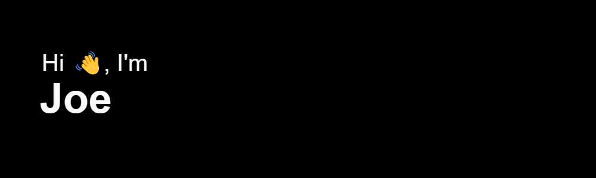

🚀 A *passionate developer* exploring the realms of code and technology. I'm on a journey to build innovative solutions and create meaningful experiences through software. My interests lie in `sovling mistery`, and I'm always excited to learn and explore new technologies.

💻 My code playground includes languages like Go, Python, JS and PHP and frameworks like Laravel. I believe in the power of open-source and love collaborating on projects that make a positive impact.

🌱 When I'm not typing away on my keyboard, you can find me enjoying the great outdoors, reading a book, or sipping a cup of coffee in a cozy corner.

📫 Let's connect and collaborate! Feel free to reach out for discussions, project ideas, or just to say hi. Happy coding! 🎉

 

## 🛠 &nbsp;Tech Stack and State

&nbsp;
&nbsp;
&nbsp;
&nbsp;
&nbsp;
&nbsp;
&nbsp;
&nbsp;
&nbsp;
&nbsp;\

&nbsp;
&nbsp;
&nbsp;
&nbsp;

&nbsp;
&nbsp;

 

---

  
  
  
  
  
 

